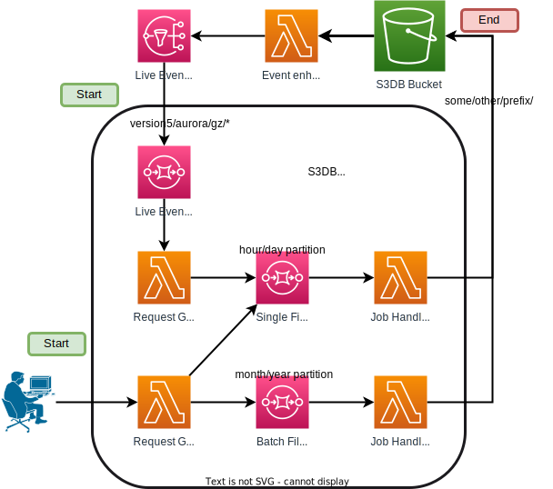

# S3DBConverter
A micro-service that converts S3DB data (Transmuter output) to various formats, compressions, and partitions.

* [General](#general)
* [Limitations](#limitations)
* [Usage](#usage)
* [Deploy and Update](#deploy-and-update)
* [Architecture](#architecture)
* [Athena SQL Reference](#athena-sql-reference)

## General
### Data Conversion Jobs
Data conversions may be triggered as a one-off job for historical data or configured as a live workload that automatically triggers on new prod data as they become available. 
Supported outputs:
* formats: `arrow`, `parquet`
* compressions: `br`, `bz2`, `gz`, `lz4`, `zst`, `sz`
* partition sizes: `hour`, `day`, `month`, `year`
* S3 directory structures:
  * `dataclient` - A [DataClient.jl](https://gitlab.invenia.ca/invenia/Datafeeds/DataClient.jl) compatible directory structure, i.e. the same directory structure as the source S3DB data.
  * `athena` - A custom directory structure that uses Apache Hive partitioning scheme - uses a single level partition based on the S3DB 'target_start' column. This is designed for optimal querying via AWS Athena. The partition key and value type used will depend on the partition size selected:
    * `hour` partition: Key - 'hour_partition', Type - timestamp, eg.'../db/table/hour_partition=2021-06-15 20:00:00/..'
    * `day` partition: Key - 'day_partition', Type - date, eg.'../db/table/day_partition=2021-06-15/..'
    * `month` partition: Key - 'month_partition', Type - date, eg.'../db/table/month_partition=2021-06-01/..'
    * `year` partition: Key - 'year_partition', Type - date, eg.'../db/table/year_partition=2021-01-01/..'

### S3DB CLI
This repository also provides a CLI utility (`s3dbcli.py`) to:
* Trigger one-off data conversion jobs on historical S3DB data
* Manage the AWS Glue Data Catalog for S3DB data

#### AWS Athena and AWS Glue Data Catalog
S3DB already contains highly structured data and it would be great if we could query S3DB directly using SQL without having to maintain costly RDBMS servers.
With a little extra work, we can achieve this via AWS Athena:
  * Re-formatting and re-partitioning S3DB data - While it is possible to query the CSV source directly, it is much more efficient to convert this CSV data to Parquet and re-partition (Hive-style) them by `day` before querying. This process is handled by our S3DBConverter micro-service.
  * A metadata store for the source data - For Athena to know how and where to query data from, it requires a data catalog to supply metadata about the source data in S3. We use AWS Glue Data Catalog as our metadata store, which stores metadata for each S3DB dataset such as S3 location, data format, compression, table schema, partitioning details, etc. This data catalog needs to be updated from time to time because new datasets may be added to S3DB and the columns/types of existing datasets may be updated over time. The `S3DB CLI` provides utilities to manage and maintain the Glue Data Catalog such as scanning the source S3DB data and adding/updating tables in the catalog.

##### Athena Partition Projection
S3DB only consists of time-series datasets, all of which have a `target_start` column, by which we use to partition the dataset.
Traditionally, each partition must be explicitly registered in the data catalog before it is accessible.
This creates extra complexity for live-populating dataset because new partitions must be manually registered in the catalog.
Additionally, the query planner retrieves partition metadata from the catalog for each query, and this may take away from the performance improvements obtained via partitioning if there are a large number of partitions.
So work around both of these issues, we use [AWS Athena Partition Projection](https://docs.aws.amazon.com/athena/latest/ug/partition-projection.html), where partition values and locations are dynamically calculated from configuration rather than read from the data catalog.
This also means we no longer have to worry about registering new partitions in the catalog as they are create because we no longer use the partition metadata.

## Limitations
1. The destination/output for converted files must be **in the same bucket** (`invenia-datafeeds-output`), but with a **non-overlapping prefix with the source** (`version5/aurora/gz/`). You can copy the converted output to any other bucket on your own.
2. **Partitioning by year will fail** for very large datasets such as CAISO Price Data due to AWS Lambda hitting max memory (10GB). We'll need to look into alternatives such as AWS Fargate or Batch if generating yearly partitions are really desired for all datasets.
3. The CLI support triggering one-off data conversion jobs on historical S3DB data, but it does not support configuring live workloads that will automatically trigger on new prod data. To do this, the `prod_listener.py` lambda function must be updated and a stack update will be needed.
4. Live data conversion workloads are only supported for hourly and daily partitions. Configuring live workloads for monthly or yearly partition are currently not supported.

## Usage
A stack with the name `S3DBConverter` has already been deployed to the production account.
Simply run the `s3dbcli.py` script provided in the repository to start up the `S3DB CLI` and follow the guided prompts.
Be sure to assume the prod account role beforehand as you will be interacting with AWS resources in the prod account.
```
pip install -r requirements.txt

export AWS_DEFAULT_PROFILE=production:admin
python s3dbcli.py
```
Data conversion jobs are one-off operations, they will not automatically trigger on new prod data.
To set up a new automated converter for live data, add a config entry to the `lambdas/prod_listener.py` function and update the prod stack.

As mentioned above, the `S3DB CLI` also provides utils to keep the AWS Glue Data Catalog up to date with S3DB data.
These operations only modify the Glue Data Catalog, not the S3 data:
* Checking for new S3DB datasets and registering them as new tables in the Glue catalog
* Updating the Glue catalog when a schema change for a dataset in S3DB is detected
* Removing registered tables from the Glue catalog

## Deploy and Update
CFN args like stack name, bucket name, bucket prefix, etc. are already hard coded as constant in `deploy.py`, so, simply run the script to update (or redeploy) the stack:
```
export AWS_DEFAULT_PROFILE=production:admin
python deploy.py
```

## Architecture


Notes:
* There are two types of workloads: live-fills and back-fills.
    * Live-fill workloads are automatically triggered as new files in prod are created/updated. S3DBConverter only subscribes to the prod bucket/prefix (`s3://invenia-datafeeds-output/version5/aurora/gz/`). The Request Generator (live, lambdas/prod_listener.py) generates pre-defined jobs and sends it off to the next stage. Currently, only hour/day partitions are supported for live-fill workloads.
    * Back-fill workloads are one-off jobs triggered manually by users via the `trigger.py` CLI. The Request Generator (backfill, aka lambdas/request_generator.py) generates user-defined jobs and sends it off to the next stage. Back-fill workloads support all partition sizes.
* There are two types of jobs: single-file jobs (hour/day partition) and batch-file jobs (month/year partition).
    * Single-file jobs are jobs that involve only a single input file. Currently, Datafeeds uses a daily (24h) partition, so jobs that do hour/day partitions are single-file jobs.
    * Batch-file jobs are jobs that involve multiple input files. Currently, Datafeeds uses a daily (24h) partition, so jobs that do month or year partitions are batch-file jobs.
* Both job handlers (lambda functions) for the single-file and batch-file jobs actually run the same code (lambdas/request_handler.py), the only difference is the batch-file lambda function is allocated more RAM.

## Athena SQL Reference
This section covers some examples of common queries that we use.
Refer to [AWS Athena DML queries, functions, and operators](https://docs.aws.amazon.com/athena/latest/ug/dml-queries-functions-operators.html) for the full documentation.

### Example 1: Partition Pruning
The Athena source data is partitioned based on the `target_start` column using the partition key `day_partition`, which has the `date` type.
This partition key acts exactly like a new column, it is separate from `target_start` and must be explicitly specified in the `WHERE` clause for partition pruning to take effect.
Specifying just the `target_start` alone will not trigger partition pruning.
```sql
# w/ partition pruning, only the relevant partitions are scanned
SELECT *
FROM
  miso.delta_price
WHERE
  day_partition BETWEEN date '2023-01-14' AND date '2023-02-05'
AND
  target_start BETWEEN to_unixtime(timestamp '2023-01-14 13:00:00') AND to_unixtime(timestamp '2023-02-05 12:00:00');

# w/o partition pruning, all partitions (the entire table) are scanned
# Note that even though the all partitions are scanned, it doesn't appear to be much slower
# because partitions are scanned in parallel, but this will lead to a higher CPU cost.
SELECT *
FROM
  miso.delta_price
WHERE
  target_start BETWEEN to_unixtime(timestamp '2023-01-14 13:00:00') AND to_unixtime(timestamp '2023-02-05 12:00:00');
```

### Example 2: Using `UNLOAD`
The `SELECT` statement only supports outputting CSV data.
If a different format is desired (eg. to get smaller-compressed data), the `UNLOAD` statement must be used.
Note that the specified output S3 prefix must be empty of the query will fail.
Refer to the [docs](https://docs.aws.amazon.com/athena/latest/ug/unload.html) for more info.
```sql
UNLOAD (
  SELECT *
  FROM
    miso.delta_price
  WHERE
    day_partition BETWEEN date '2023-01-14' AND date '2023-02-05'
  AND
    target_start BETWEEN to_unixtime(timestamp '2023-01-14 13:00:00') AND to_unixtime(timestamp '2023-02-05 12:00:00')
) 
TO
  's3://my_athena_data_location/my_folder/' 
WITH (
  format='PARQUET',
  compression='gzip'
);

```

### Example 3: Getting Only the Latest Release
Gets the latest release given a release_date threshold (sim_now) on a specific list of nodes for each node-hour in miso delta prices.
```sql
# validity = [2023-01-14 13:00:00, 2023-02-05 12:00:00]
# sim_now  = 2023-02-05 13:50:00
# nodes    = 536 nodes
WITH inject_latest AS (
  SELECT
    target_end,
    node_name,
    lmp,
    sum_mcc_mlc,
    release_date,
    MAX(release_date) OVER (PARTITION BY target_end, node_name) AS latest_release
  FROM
    miso.delta_price
  WHERE
    day_partition BETWEEN date '2023-01-14' AND date '2023-02-05'
    AND target_end BETWEEN to_unixtime(timestamp '2023-01-14 13:00:00') AND to_unixtime(timestamp '2023-02-05 12:00:00')
    AND release_date < to_unixtime(timestamp '2023-02-05 13:50:00')
    AND node_name IN ('AECI', 'AECI.ALTW', 'AECI.AMMO', 'AECI.APM_2.AZ', 'AEP', 'ALTE.ALTE', 'ALTE.PAR_1.AZ', 'ALTE.WPPI_1.AZ', 'ALTW.ALTW', 'ALTW.AMESWIND', 'ALTW.ARMST.ARR', 'ALTW.BART1NIPS', 'ALTW.BENT_TREE', 'ALTW.BEPM.CBLD', 'ALTW.BRLGTN1', 'ALTW.BROOKE1', 'ALTW.CMMPA.MTL', 'ALTW.CMMPA.SPR', 'ALTW.CRLK2WPL', 'ALTW.ELKWIND', 'ALTW.ENDV', 'ALTW.FAIR1.ARR', 'ALTW.FRNKLNCO', 'ALTW.HAHN.ARR', 'ALTW.HAWKEYE1', 'ALTW.HCPD.STHP', 'ALTW.HCPD.TRU', 'ALTW.JOULGSCIP', 'ALTW.JOUNEAL3', 'ALTW.LANS3.ARR', 'ALTW.LKFLD.IPL', 'ALTW.MECB', 'ALTW.MMPA.OGWF', 'ALTW.MONTA.ARR', 'ALTW.MOWERCO', 'ALTW.MQOKT.ARR', 'ALTW.MTOWNCT1', 'ALTW.NSP', 'ALTW.PIOPRAIR1', 'ALTW.PRARC1', 'ALTW.RIPPEY1', 'ALTW.ROQUETTE1', 'ALTW.SMP', 'ALTW.WPPI', 'ALTW.WPPI_1.AZ', 'ALTW.WRTHNGT', 'ALTW.WSEC3', 'AMIL.ACL9', 'AMIL.AEM.CAT', 'AMIL.AEM.NWTN', 'AMIL.AEM.RPGI', 'AMIL.ALSEYCTG1', 'AMIL.AMAEAMAN', 'AMIL.AMER', 'AMIL.AMS_ASTOR', 'AMIL.ANI_AANIT', 'AMIL.BALDSSAUX', 'AMIL.BALDWI51', 'AMIL.BSEINDIP1', 'AMIL.CC.CSTN', 'AMIL.CC.GDTWR1', 'AMIL.CCG_1.AZ', 'AMIL.CCG_2.AZ', 'AMIL.CILC.AZ', 'AMIL.CIPS.AZ', 'AMIL.CLAY_1.AZ', 'AMIL.CLINTO51', 'AMIL.COG_ACOGG', 'AMIL.DAYTON', 'AMIL.DEWITT', 'AMIL.EDWARDS2', 'AMIL.EDWARDS3', 'AMIL.GBCCTG1', 'AMIL.GBCM', 'AMIL.HEN_AMT_P', 'AMIL.IMEA_1.AZ', 'AMIL.IOW_AFRYT', 'AMIL.IP.AZ', 'AMIL.IP.IMEA', 'AMIL.L69_AHOPK', 'AMIL.NEC1_1.AZ', 'AMIL.NEWTON21', 'AMIL.NLT_ANEW_', 'AMIL.OGLES.ARR', 'AMIL.PTWF', 'AMIL.REI2CTGA', 'AMIL.RPGI_1.AZ', 'AMIL.RSPWIND', 'AMIL.SIPM_1.AZ', 'AMIL.SOY_2.AZ', 'AMIL.STLNG.ARR', 'AMIL.STWF', 'AMIL.SWECCTG1', 'AMIL.TBCRSTAT', 'AMIL.TRA_ATRAE', 'AMIL.VIN_AVINT', 'AMIL.WLBRWEST', 'AMIL.WVPA_2.AZ', 'AMIL.W_BRCTIPT', 'AMMO.AEM.MO', 'AMMO.AUDRN11', 'AMMO.CALF_1.AZ', 'AMMO.CALLAWAY1', 'AMMO.CC.KEOKUK', 'AMMO.CC.OSAGE', 'AMMO.CCG_1.AZ', 'AMMO.FGRDCTG1', 'AMMO.GOOSEGEN2', 'AMMO.HANN_1.AZ', 'AMMO.KAHO_1.AZ', 'AMMO.KIRK_1.AZ', 'AMMO.KMDYCTG1', 'AMMO.LABADIE1', 'AMMO.LINN_1.AZ', 'AMMO.MARC_1.AZ', 'AMMO.MERAMEC1', 'AMMO.MEXCTG1', 'AMMO.MOBCTG1', 'AMMO.OSAGE1', 'AMMO.PENOCTG1', 'AMMO.PERR_1.AZ', 'AMMO.PNKYCTG1', 'AMMO.RCCKCTG1', 'AMMO.SIOUX1', 'AMMO.SIOUX2', 'AMMO.TS1', 'AMMO.TS2', 'AMMO.UA.AZ', 'AMMO.WVPA', 'ARKANSAS.HUB', 'BREC.AZ', 'BREC.BREC', 'BREC.CENTURY', 'BREC.GREEN1', 'BREC.WILSON1', 'CIN.08NOBSN1', 'CIN.CAYCT.4', 'CIN.CAYUGA.1', 'CIN.CC.EDWIGCC', 'CIN.CC.SUGRCK', 'CIN.CT.VERMN.1', 'CIN.DEI.AZ', 'CIN.GIBSON.1', 'CIN.HENRYCO.1', 'CIN.LOGANOAKR', 'CIN.MADISON.1', 'CIN.MARKLND.1', 'CIN.PSI_2.AZ', 'CIN.PSI_3.AZ', 'CIN.TWINBR1', 'CLEC.AXLA', 'CLEC.CC.CPS6', 'CLEC.CLEC', 'CLEC.CPS6ST', 'CLEC.CPWR_2.AZ', 'CLEC.CPWR_3.AZ', 'CLEC.CPWR_4.AZ', 'CLEC.CPWR_5.AZ', 'CLEC.CPWR_6.AZ', 'CLEC.CPWR_7.AZ', 'CLEC.DEMCO', 'CLEC.DPS', 'CLEC.TPS3', 'CONS.ADA', 'CONS.ALCONA', 'CONS.ALPENTHBA', 'CONS.AZ', 'CONS.BSE.CEC', 'CONS.CA3.MPPA', 'CONS.CADILAC', 'CONS.CAMPBELL2', 'CONS.CC.MICHP', 'CONS.CROTON', 'CONS.EXGNBB1', 'CONS.GENESEE', 'CONS.GRATIOT1', 'CONS.GYRD1WPSC', 'CONS.HARDY', 'CONS.HODENPYL', 'CONS.KALK', 'CONS.KAL_RGEN_', 'CONS.KARN1', 'CONS.LANS', 'CONS.LIVINGEN1', 'CONS.MCV', 'CONS.MPPA', 'CONS.MPPA_3.AZ', 'CONS.MSCPA', 'CONS.MWEC', 'CONS.PALISA2A1', 'CONS.RENAIGEN1', 'CONS.SCIT', 'CONS.SCWND1', 'CONS.TUSCOLA1', 'CONS.VKLINCOLN', 'CONS.VKMCBAIN1', 'CONS.WOLV', 'CONS.WPSC_1.AZ', 'CONS.WVPA_1.AZ', 'CONS.ZEELAND1A', 'CPLE', 'CPLW', 'CSWS', 'CSWS.AEPM_1.AZ', 'CSWS.AEPM_2.AZ', 'CSWS.AEPM_3.AZ', 'CSWS.HOPE', 'CWLD.AZ', 'CWLD.BLRG', 'CWLD.CEC2CTG1', 'CWLD.FULT', 'CWLP.AZ', 'CWLP.INTERSA81', 'DECO.AZ', 'DECO.BAUER.MVP', 'DECO.BLR1.DEMO', 'DECO.BROOKFLD1', 'DECO.CC.DIG2', 'DECO.CMS_THMB', 'DECO.COFAXP11', 'DECO.CWEP', 'DECO.DAYTN.ARR', 'DECO.DLRYP11', 'DECO.ESSEX.ARR', 'DECO.EXGNHW2', 'DECO.FERMI2', 'DECO.FRMP112', 'DECO.MCKINLEY1', 'DECO.MINDEN1', 'DECO.MONROE1', 'DECO.MONROE3', 'DECO.MSCPA', 'DECO.NEP111', 'DECO.PINE_TREE', 'DECO.PLACDP12', 'DECO.PUTNMP11', 'DECO.RRP11', 'DECO.SUPP111', 'DECO.TRNCNL9', 'DECO.TUSCOLA2', 'DECO.WILMTP11', 'DPC.AZ', 'DPC.FLAMBEAU', 'DPC.NSPLOAD', 'DPC.NWEC.AZ', 'DUK', 'EAI.AECCBAILEY', 'EAI.AECCHYDRO2', 'EAI.AECCHYDRO9', 'EAI.AECCLD', 'EAI.AECCMCCLLN', 'EAI.AECCMGVCT1', 'EAI.ANO1', 'EAI.ARSNC1.ARR', 'EAI.BLAKELY1', 'EAI.BUBALD', 'EAI.CC.PBENRGY', 'EAI.COUCH2.ARR', 'EAI.CWL_1.AZ', 'EAI.DEGRAY1', 'EAI.EAILD', 'EAI.ELDORA.ARR', 'EAI.HASKL1.ARR', 'EAI.INDEPEND1', 'EAI.INDEPEND2', 'EAI.LK_CATH4', 'EAI.LYNCH2.ARR', 'EAI.MABELV.ARR', 'EAI.OMLP_1.AZ', 'EAI.PLUM_1C', 'EAI.RITCH3.ARR', 'EAI.SHRDN1.ARR', 'EAI.WHBLF.ARR', 'EAI.WH_BLUFF1', 'EAI.WMULDLD', 'EAI.WODLN1.ARR', 'EAI.WSTMMP.ARR', 'EDE.PLUM', 'EES.ACADA1.ARR', 'EES.AXIALL', 'EES.BASTAP.ARR', 'EES.BGTEL1.ARR', 'EES.BRAZLD', 'EES.BXTRW5.ARR', 'EES.CALDWEL.AZ', 'EES.CC.NINEM6', 'EES.COLY1.ARR', 'EES.CTEAU2.ARR', 'EES.DBAYO1.ARR', 'EES.DERSLD', 'EES.DOWCHEM', 'EES.EGMP_1.AZ', 'EES.EGMP_2.AZ', 'EES.ELMP_1.AZ', 'EES.EMMP_1.AZ', 'EES.EMMP_2.AZ', 'EES.ETEC', 'EES.ETILD', 'EES.FLRNCE.ARR', 'EES.FRONT_TX3', 'EES.FRSKR1.ARR', 'EES.HRTBRG.ARR', 'EES.JAXSNS.ARR', 'EES.KRBYVLE.AZ', 'EES.MORTN1.ARR', 'EES.NEWTON', 'EES.NSIDE1.ARR', 'EES.RVRBEND1', 'EES.SCY_LD', 'EES.SRMPA', 'EES.STERL7', 'EES.SWTZ1.ARR', 'GRE.ALTW', 'GRE.AZ', 'GRE.ELKRI4', 'GRE.GRE', 'GRE.HUC', 'GRE.MP.GRE', 'GRE.NSP', 'GRE.NSP.GREC', 'GRE.NSPP_1.AZ', 'GRE.SMP', 'GRE.SMP.GRE', 'GRE.WILM', 'HE.07LCPGEN1', 'HE.MEROM1', 'HE.SIGW', 'HE.WORTH1', 'ILGEN3.AGG', 'ILGEN5.AGG', 'ILGEN7.AGG', 'ILLINOIS.HUB', 'INDIANA.HUB', 'IPL.16PETE.AGG', 'IPL.16STOC4C4', 'IPL.16STOC5C5', 'IPL.16SYST.AGG', 'IPL.AZ', 'IPL.HE', 'LAGN.BC2_1', 'LAGN.LAGN', 'LEPA.AZ', 'LEPA.MURRAY', 'LGEE', 'MDU.AZ', 'MDU.CEDARHLS', 'MDU.GLENDC1', 'MDU.MCTURB1', 'MDU.MDU', 'MDU.MPC', 'MDU.TATANKA1', 'MDU.WISHEK1', 'MEC.ADAIR_W1', 'MEC.ALTM_1.AZ', 'MEC.ALTW', 'MEC.AMES', 'MEC.AZ', 'MEC.BEPM_1.AZ', 'MEC.CAROL_W1', 'MEC.CC.GDM1', 'MEC.CENTURY_1', 'MEC.CFU', 'MEC.CHASCS1', 'MEC.CMMPA.ELD', 'MEC.CMMPA.MONT', 'MEC.CORALV1', 'MEC.ECLIPSE1', 'MEC.FARMER', 'MEC.KNOXIN_1', 'MEC.LAUREL_1', 'MEC.LUNDGREN', 'MEC.LUNDQS_1', 'MEC.LVED_1.AZ', 'MEC.MACKSBURG', 'MEC.MEAN.LD', 'MEC.MEAN_1.AZ', 'MEC.MEAN_3.AZ', 'MEC.MEAN_4.AZ', 'MEC.MEAN_6.AZ', 'MEC.MEAN_7.AZ', 'MEC.MEAN_8.AZ', 'MEC.MOLCT_14', 'MEC.NWHAR_IBR', 'MEC.OTTUMWA1', 'MEC.PELLA', 'MEC.POCHNT_1', 'MEC.RLGY01', 'MEC.ROLLHILL_1', 'MEC.SHENDO_1', 'MEC.VICTRM_1', 'MEC.VIENNA1', 'MEC.WALNUT_W1', 'MEC.WELLSBURG', 'MGE.AZ', 'MICHIGAN.HUB', 'MINN.HUB', 'MP.AZ', 'MP.BISON1', 'MP.BLNCHR123', 'MP.DLPLOAD', 'MP.HVDCE', 'MP.MPM_1.AZ', 'MP.MRES', 'MP.THOMSON', 'MPS.CROSSROAD1', 'MPW.AZ', 'NIPS.AZ', 'NIPS.BURROAK.H', 'NIPS.BURROAK.L', 'NIPS.CC.WHITN', 'NIPS.DR.PRAXAR', 'NIPS.HWND1.IPL', 'NIPS.IMPA', 'NIPS.MCHCP.ARR', 'NIPS.MICHCP12', 'NIPS.MITCH.ARR', 'NIPS.MUNSTR.LN', 'NIPS.NORWAPNOR', 'NIPS.OAKDAPOAK', 'NIPS.SCHAHP16A', 'NIPS.SCHAHP17', 'NIPS.STJOHN.LN', 'NIPS.WVPA', 'NIPS.WVPA_1.AZ', 'NSP.ALTM_1.AZ', 'NSP.AZ', 'NSP.BE', 'NSP.BLKBROOK', 'NSP.CMMPA.DEL', 'NSP.CMMPA.FAIR', 'NSP.CMMPA.GF', 'NSP.CMMPA.GLEN', 'NSP.CMMPA.JANE', 'NSP.CMMPA.KASS', 'NSP.CMMPA.KEN', 'NSP.CMMPA.SE', 'NSP.HCPD.GRVCT', 'NSP.HCPD.LKCR', 'NSP.HCPD.NU', 'NSP.HCPD.SXFLS', 'NSP.HIBRDG9_1', 'NSP.KASOTA', 'NSP.MMPA', 'NSP.MMU_1.AZ', 'NSP.MRES_5.AZ', 'NSP.NCP.AZ', 'NSP.NWEC.AZ', 'NSP.PRISL1_LD', 'NSP.SARTELL', 'NSP.SMP', 'NSP.STCLOUD1', 'NSP.UPLS_1.AZ', 'NSP.WIMUNI.AZ', 'NSP.WPPI', 'NYISO', 'ONT', 'ONT.DECO.PSOUT', 'ONT_W', 'OTP.ASHTAIII', 'OTP.AZ', 'OTP.BIGSTON1', 'OTP.CENTER1', 'OTP.COYOT1', 'OTP.EDGLYEDGL', 'OTP.GRANTCO', 'OTP.GRE', 'OTP.GRE.DSA', 'OTP.HETLA', 'OTP.HOOTL2', 'OTP.JAMSPK1', 'OTP.LAKESWIND', 'OTP.LANGDN1', 'OTP.MMPA', 'OTP.MPC', 'OTP.MPC.BUTLER', 'OTP.MPC.OXBOW', 'OTP.MRES', 'OTP.MRES.CVLR', 'OTP.MRES.HILS', 'OTP.MUAG', 'OTP.NSP', 'OTP.OTP', 'OTP.OTPW_10.AZ', 'OTP.OTPW_11.AZ', 'OTP.OTPW_12.AZ', 'OTP.OTPW_2.AZ', 'OTP.RUGBY1MRES', 'OTP.SLWAYO1', 'PSI_GEN.AGG', 'SCEG', 'SIGE.10ABBGN1', 'SIGE.10CULGN2', 'SIGE.AZ', 'SIGE.FOWLR', 'SIPC.5MRN_PN14', 'SIPC.AZ', 'SME.AZ', 'SME.BATESV_1', 'SME.CC.MOS_CC1', 'SME.GRANDGULF', 'SME.LEAFRIVER', 'SME.SLVRCRK_1', 'SME.SYLV_1', 'SMP.AZ', 'SMP.RPU', 'SOCO', 'SOCO.FORIN.ARR', 'SPA', 'SPC', 'TEXAS.HUB', 'TVA', 'TVA.BRMNH1.ARR', 'TVA.TVA', 'TVA.TVAM_1.AZ', 'TVA.WHITEOAK', 'UPPC.ESC.AZ', 'WAUE.HANCCBPC', 'WEC.AZ', 'WEC.ERGS_LD', 'WEC.KCBL_AP', 'WEC.OCONTFL', 'WEC.PB1AUX', 'WEC.PLSNT1.MVP', 'WEC.RBC1', 'WEC.WEPM_1.AZ', 'WEC.WEPM_2.AZ', 'WEC.WPPI', 'WEC.WPPI_3.AZ', 'WPS.AZ', 'WPS.FORWARD', 'WPS.GLU', 'WPS.GRFTR.ARR', 'WPS.MENOMPK', 'WR.MEUCFRED1', 'WR.MEUC_1.AZ', 'WR.MOWR')
) SELECT
    from_unixtime(target_end) as HE,
    node_name,
    lmp,
    sum_mcc_mlc
FROM inject_latest
WHERE
  release_date = latest_release

```
